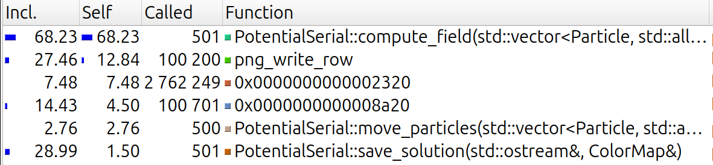
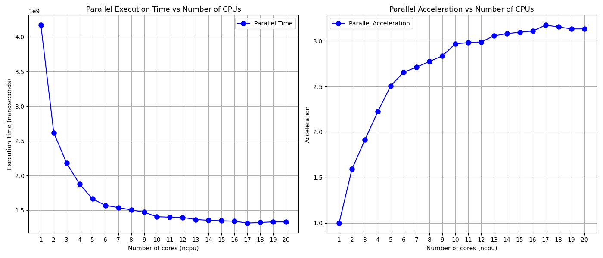

# Rapport tp1 - INF5171

Dominique Elias (ELID14019800)

## Profilage



```sh
valgrind --tool=callgrind ./build-profile/bin/potential -i 500 -dt 2e-9 -n 25 -r 200 -e 1
```

| Fonction  | | % de temps | Acceleration attendue |
|-----------|-----|-------|-----------------------|
| PotentialSerial::compute_field     | | 68.23%       | 2.84                  |
| PotentialSerial::move_particles    | | 2.76%        | 1.02                  |
| PotentialSerial::save_solution     | | 1.50%        | 1.01                  |
| Total | | 72.49% | 3.21|

Loi d'Amdhal:

```math
S(n) = 1 / ( (1 - p) + p/n )
```

* S(n) est l'accéleration theorique.
* p est la fraction de l'algorithme qui peut être parallélisée.
* n est le nombre de coeurs du CPU.

Le nombre de coeurs de mon ordinateur est 20 (14 physiques et 6 logiques).

compute_field acceleration:

```math
S(20) = 1 / ( (1 - 0.6823) + 0.6823/20 ) = 2.84
```

move_particles acceleration:

```math
S(20) = 1 / ( (1 - 0.0276) + 0.0276/20 ) = 1.02
```

save_solution acceleration:

```math
S(20) = 1 / ( (1 - 0.0150) + 0.0150/20 ) = 1.01
```

acceleration total:

```math
S(20) = 1 / ( (1 - 0.7249) + 0.7249/20 ) = 3.21
```

En supposant que les trois fonctions sont parfaitement parallélisables, la proportion série du programme est de 27.51%.

| Parallelizable Portion (P) | Serial Portion (1 - P) |
|----------------------------|------------------------|
| 72.49%                     | 27.51%                 |

## Choix de la parallélisation

### Struct LoHi

Étant donné que `parallel::reduce` ne peut être utilisé qu'avec une seule variable, nous avons créé une structure pour stocker à la fois les valeurs minimales et maximales. À l'intérieur de la structure, nous avons déclaré le constructeur des valeurs initiales qui sera utilisé dans `reduce`, ainsi que la fonction de réduction `combine` qui combinera toutes les valeurs `lohi` (min et max) résultantes.

### compute_field

Nous avons utilisé `parallel::reduce` car il permet de diviser le tableau en plusieurs parties indépendantes. Chaque partie est traitée en parallèle pour calculer les valeurs minimales et maximales. Ensuite, le min et le max finaux sont obtenus en combinant les min et max de chaque partie.

### move_particles

Nous avons utilisé `parallel::for` pour les deux boucles `for` internes, mais pas pour la boucle externe, car la deuxième boucle interne est dépendante de la première.

### save_solution

Étant donné que chaque pixel est indépendant, nous pouvons utiliser `parallel::for` pour les deux boucles et tirer parti de `blocked_range2d`, principalement pour bénéficier de la **localité cache**.


## Implémentation des tests

Pour tester les fonctions en série et en parallèle, nous créons deux vecteurs de particules ainsi que deux paires de valeurs minimum et maximum, qui seront exécutés en série et en parallèle. Après chaque traitement, nous comparons les valeurs obtenues.

N.B. Pour la comparaison, nous utilisons la valeur `abstol` comme tolérance.

Voici les étapes :

1. Créer deux variables du type `IPotential`, une pour le traitement en série et l'autre pour le traitement en parallèle :

    ```cpp
    IPotential *serial = new PotentialSerial();
    IPotential *parallel = new PotentialParallel();
    ```

2. Créer deux vecteurs de particules, ainsi que deux paires de valeurs `min` et `max` :

    ```cpp
    std::vector<Particle> particles_serial;
    double lo_serial, hi_serial;

    std::vector<Particle> particles_parallel;
    double lo_parallel, hi_parallel;
    ```

3. Ensuite, peupler les deux vecteurs de particules (il existe plusieurs expériences, donc un test complet a été effectué pour chaque expérience) :

    ```cpp
    experiment_basic(particles_serial);
    experiment_basic(particles_parallel);
    ```

Une fois les deux vecteurs de particules créés, nous pouvons les traiter en série et en parallèle, puis comparer les résultats.

## Benchmarks



1. Le premier graphe montre le temps d'exécution en fonction du nombre de coeurs utilisés.
2. Le deuxième graphe montre l'accélération en fonction du nombre de coeurs utilisés.

On observe que le temps d'exécution diminue à mesure que le nombre de cœurs augmente, tandis que l'accélération décroît. Cela s'explique en partie par l'overhead lié à la parallélisation, mais également par la loi d'Amdahl, qui limite l'accélération en fonction de la proportion séquentielle du programme.

L'accélération maximale théorique est de 3,21, et nous obtenons ici une accélération maximale de 3,11, ce qui indique une bonne parallélisation.

## Note

Tout build et exécution a été fait en ligne de commande, voici un exemple des commandes utilisées:

```sh
cmake -G Ninja -S . -B build-release -DCMAKE_BUILD_TYPE=Release
cmake --build build-release
./build-release/bin/potential -i 500 -dt 2e-9 -n 25 -r 200 -e 1
```

Pour les tests:

```sh
./build-release/bin/test_parallel
```

pour profilage:

```sh
cmake -G Ninja -S . -B build-profile -DCMAKE_BUILD_TYPE=RelWithDebInfo
cmake --build build-profile
valgrind --tool=callgrind ./build-profile/bin/potential -i 500 -dt 2e-9 -n 25 -r 200 -e 1
```

pour les benchmarks:
un fichier bench-random.dat est généré dans le repertoire courant.
`plot.py` est utilisé pour générer les graphiques. pas inclus dans l'archive zip.

```sh
./build-release/bin/bench_potential
python3 plot.py
```
